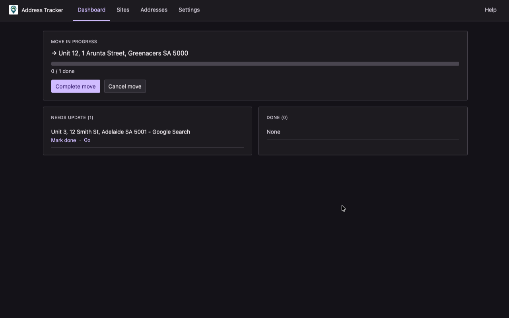
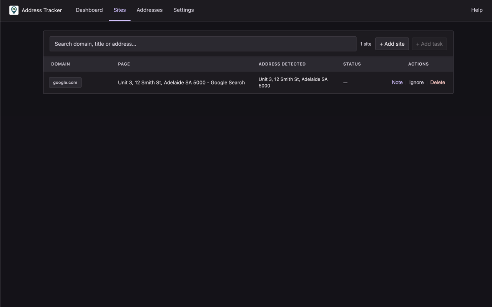
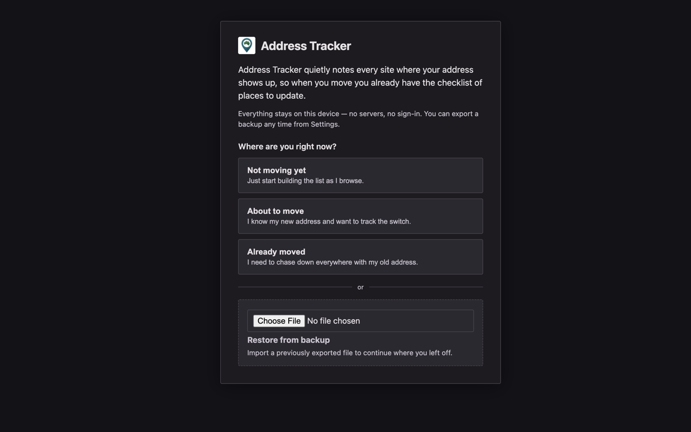
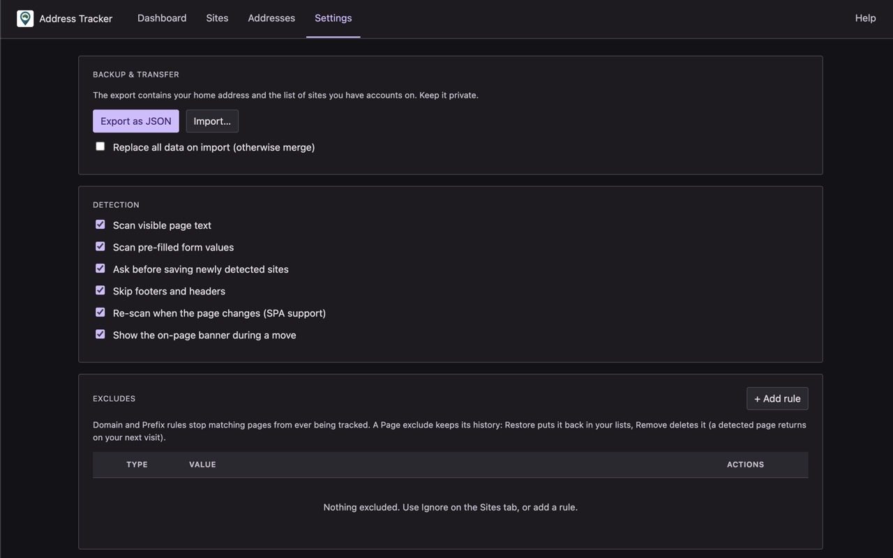

# Address Tracker

A Chrome extension that keeps a private, on-device list of every website showing your home address — so when you move,
the update checklist already exists.

[**Install from the Chrome Web Store**](https://chromewebstore.google.com/detail/fffekdlpbgbmpnplfibmkigfeaonjhpp) · [**Watch the demo**](https://www.youtube.com/watch?v=pFAJYbqWhx0) · [**Report an issue**](https://github.com/Mimas-Tech/address-tracker/issues)

## Why

Moving house means updating your address everywhere, and the hard part is remembering where "everywhere" is: your bank,
your super fund, your electricity provider, the shop that still posts you things. You usually find the ones you forgot
when a bill goes to the old place.

Address Tracker builds the list before you need it. Enter your address once and browse normally; when a page shows your
address, the extension asks whether to save that site. By the time you move, the checklist is already written.

## How it works

1. **Set up once.** Enter your current address. Matching understands Australian address conventions — states, postcodes,
   street abbreviations (St/Street, SA/South Australia) — and v1 is Australia-only.
2. **Browse normally.** When a new site shows your address, a small on-page prompt asks whether to save it, or to
   exclude that page, the whole domain, or a URL prefix. Prefer silence? Turn the prompt off in Settings and sites are
   recorded automatically.
3. **Start a move.** Enter the new address; every saved site becomes an item on your checklist, and the toolbar badge
   counts what's left.
4. **Work the list.** While a page still shows the old address, a banner reminds you and offers the new address to copy;
   the item is marked done when the new address appears. Off-web tasks — calling your insurer, visiting a post office —
   sit in the same checklist so progress covers the whole move.

One limitation, stated plainly: the extension can only record sites you actually visit while it's installed, and only
when the address is visible on the page. Install it well before you move and the list builds itself; anything it misses,
you add by hand.

## Screenshots

|                                                                                      |                                                         |
|--------------------------------------------------------------------------------------|---------------------------------------------------------|
|  |  |
|                            |    |

## Privacy

Everything stays on your device. The extension has no server, no account, and makes no network requests. Pages are
scanned locally and only the fact that your address appeared on a URL is stored — never page content or form values.
Backup and cross-device transfer happen through a JSON file you export and import yourself. Full
policy: [docs/privacy-policy.md](docs/privacy-policy.md).

## Install

**From the Chrome Web Store:** [chromewebstore.google.com/detail/fffekdlpbgbmpnplfibmkigfeaonjhpp](https://chromewebstore.google.com/detail/fffekdlpbgbmpnplfibmkigfeaonjhpp)

**From source:** clone this repository, open `chrome://extensions`, enable Developer mode, click *Load unpacked*, and
select the repository folder.

## Development

- **Run tests:** `node test/engine.test.js`
- **Build the store package:** `sh scripts/package.sh` → `dist/address-tracker-<version>.zip`
- **Regenerate icons** from the source artwork:
  `cd icons && for s in 16 32 48 128; do sips -z $s $s high.png --out $s.png; done`
- **Store listing copy and submission notes:** [docs/store-listing.md](docs/store-listing.md)

The extension is plain Manifest V3 JavaScript with no build step and no dependencies: `shared/` holds the matching and
storage engine (unit-tested without Chrome), `background.js` is the service worker, `content.js` does on-page detection,
and `popup/`, `onboarding/`, `management/` are the UI pages.

## Feedback and support

Bugs, feature requests and suggestions are welcome on
the [issue tracker](https://github.com/Mimas-Tech/address-tracker/issues).

- Rajan Paneru — [paneru.rajan@gmail.com](mailto:paneru.rajan@gmail.com)
- Edwin Jose George — [edwinjosegeorge@gmail.com](mailto:edwinjosegeorge@gmail.com)
